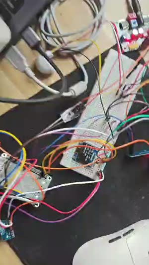

# RS485 多传感器环境监测网关（STM32F407 + FreeRTOS）

基于 **STM32F407VGT6** 的工业 RS485 总线数据采集网关：以 **Modbus RTU 主站**轮询总线上的光照 / 温湿度传感器，经 **FreeRTOS 多任务**调度完成采集、显示、报警与 **ESP-01S Wi-Fi TCP** 远程上报，是一套完整的嵌入式「采集 → 处理 → 交互 → 上云」工程实践。

   

> 配套作品：[pid-gateway](https://github.com/MYX-0211/pid-gateway)（电机 PID 速度闭环 + CAN 双向）——两项目形成「采集上云 + 实时控制」互补，覆盖工控常见双链路。

**English Overview**: FreeRTOS-based industrial RS485/Modbus-RTU sensor gateway on STM32F407VGT6 — polls lux/temp-humidity sensors over a half-duplex bus (DMA + idle-line framing, CRC16), drives OLED/key/buzzer, and reports to a TCP server via ESP-01S Wi-Fi.

## 目录

- [系统架构](#系统架构)
- [功能特性](#功能特性)
- [硬件清单](#硬件清单)
- [软件设计要点](#软件设计要点)
- [OTA 固件升级](#ota-固件升级)
- [工程结构](#工程结构)
- [环境与构建](#环境与构建)
- [运行配置](#运行配置)
- [运行效果](#运行效果)

## 系统架构

```
                    ┌────────────────────────────────────────────┐
                    │            STM32F407VGT6 (168MHz)           │
   RS485 总线       │                                            │
┌────────────┐      │  ┌─────────┐   数据帧    ┌──────────────┐  │
│ 光照传感器  │◄────┼──┤         │───────────►│              │  │
│ 0x01 (Lux) │      │  │  Modbus │  xQueue    │   OLED 显示   │  │
├────────────┤      │  │ RTU 主站│   (深1)    │  (4行×16字符) │  │
│ 温湿度传感器│◄────┼──┤         │◄───────────│              │  │
│ 0x02 (TH)  │      │  └────┬────┘            └──────┬───────┘  │
└────────────┘      │       │ 报警标志                 │          │
  USART1 + MAX485   │       ▼                         ▼          │
                    │  ┌─────────────────────────────────────┐   │
                    │  │  FreeRTOS 多任务调度                  │   │
                    │  │  sensor(3) > led(2) > net/oled/key(1)│   │
                    │  └──────┬──────────────────┬────────────┘   │
                    │         │                  │                │
                    │         ▼                  ▼                │
                    │  蜂鸣器 + 3×LED 报警指示    ESP-01S (Wi-Fi)  │
                    └────────────────────────────┼────────────────┘
                                                 │ TCP Socket
                                                 ▼
                                       PC 调试工具 / 上位机 (TCP Server)
```

**串口资源分配**

| 外设 | 引脚 | 波特率 | 用途 |
|---|---|---|---|
| USART1 + MAX485 | PA9/PA10（DE=PA8） | 9600 8N1 | RS485 总线（Modbus RTU） |
| USART2 | PA2/PA3 | 115200 8N1 | printf 调试输出 |
| USART3 | PB10/PB11 | 115200 8N1 | ESP-01S Wi-Fi 模块 |
| I2C1 | PB6(SCL)/PB7(SDA) | 400kHz | SSD1306 OLED (0x78) |

## 功能特性

- **Modbus RTU 主站协议**：手写 CRC16-Modbus 校验；`0x03` 读保持寄存器完整事务（组帧 → 中断发送 → 空闲中断判帧接收 → 校验 → 大端解析），带完整错误码区分（无响应 / CRC 错 / 异常帧 / 地址不符）
- **RS485 半双工驱动**：DMA + 空闲中断（`HAL_UARTEx_ReceiveToIdle_DMA`）自动判帧，天然满足 Modbus RTU 3.5 字符帧间隔；DE 方向在 TC 中断精确切换，保证末位数据完整
- **FreeRTOS 多任务**：采集（最高优先级）/ LED 指示 / OLED 显示 / 按键 / 网络上报 五任务；采集任务以 `vTaskDelayUntil` 实现 1s 不漂移周期
- **任务间通信与同步**：深 1 队列 + `xQueueOverwrite` 广播最新数据帧；互斥锁保护 RS485 总线与 printf 输出；信号量实现发送/接收完成同步（含 ISR 安全释放）
- **温度越限报警**：三态判定 + 回差（hysteresis）防抖，按键可在线调节阈值并落 OLED 设置页
- **ESP-01S Wi-Fi 上报**：AT 指令完整状态机（退出透传 → 复位 → 探测 → STA 配网 → TCP 连接），UART 丢字节环境下健壮的多关键字匹配与安全重试
- **MQTT 双向通信**：经 ESP-01S 接入 EMQX，上行 5s 周期上报 JSON（光照/温湿度/报警），下行订阅 `rs485gw/cmd` 接收阈值设置与查询指令
- **OTA 固件升级**：Bootloader + 双区切换 + 外部 SPI Flash 暂存，CRC16 整包校验与回读校验，校验失败自动保持旧固件运行
- **参数掉电保存**：报警阈值写入外部 Flash 参数区，采用日志式追加写（避免频繁擦除），上电自动加载
- **工业传感器解析**：按厂商特殊编码解析温度（非标准 int16 补码），32 位光照跨寄存器大端合并；温湿度经 `0x04` 读输入寄存器

## 硬件清单

| 器件 | 型号/参数 | 说明 |
|---|---|---|
| 主控 | STM32F407VGT6 | 168MHz，1MB Flash / 192KB RAM |
| 总线收发 | MAX485 | RS485 半双工，PA8 方向控制 |
| 光照传感器 | B-RS-L30（Modbus，地址 0x01） | 寄存器 0x0002，32 位值 ÷1000 = Lux |
| 温湿度传感器 | HKDZ-SHT30-RS（Modbus，地址 0x02） | 寄存器 0x0000/0x0001，厂商特殊编码 |
| Wi-Fi 模块 | ESP-01S（ESP8266） | STA 模式，TCP Client |
| 外部 Flash | W25Q64（8MB SPI NOR） | OTA 固件暂存 + 参数区，SPI1（PB3/PB4/PB5，CS=PA4） |
| 显示 | SSD1306 OLED 0.96" | I2C，4 行 × 16 字符 |
| 交互 | 按键 ×3 / 有源蜂鸣器 / LED ×3 | 阈值调节、报警指示 |

## 软件设计要点

**任务划分与数据流**

| 任务 | 优先级 | 周期 | 职责 |
|---|---|---|---|
| `vTaskSensor` | 3 | 1s（绝对节拍） | RS485 总线锁内轮询两路传感器 → 报警判定 → 打包入队 |
| `vTaskLED` | 2 | 200ms | 报警时三灯轮闪 |
| `vTaskNet` | 1 | 5s | 取最新帧，经 ESP-01S TCP 上报；断线后台重连 |
| `vTaskOLED` | 1 | 200ms | Peek 最新帧刷新显示；设置页显示阈值调节界面 |
| `vTaskKey` | 1 | 10ms | 消抖 + 边沿检测，KEY1 切设置页 / KEY2/3 调阈值 |

**体现工程能力的关键处理**

- **RS485 总线互斥**：Modbus 事务全程持锁，锁内只做单次最短事务、锁外重试，避免与后续 Shell 等总线使用者冲突
- **HAL timebase 修复**：CubeMX 生成的 TIM6 中断未在 NVIC 使能，曾导致 `HAL_Delay` 卡死；手动「清 pending → 优先级 0 → 使能」根治（该中断不触碰任何 RTOS API，优先级 0 安全）
- **printf 重定向加锁**：`fputc` 经互斥锁串行化到 UART2，多任务并发打印不交错；调度器启动前自动降级裸发
- **栈与堆防护**：使能 `configCHECK_FOR_STACK_OVERFLOW` 与 malloc 失败钩子，爆栈/堆耗尽时打印任务名并停机，便于定位
- **ESP 初始化异步化**：配网与 TCP 重试（最坏数十秒）放入 `vTaskNet` 后台执行，调度器与 OLED 立即启动，不被网络阻塞
- **ESP 接收通道改造**：早期逐字节阻塞轮询在高优先级任务抢占时会丢字节（USART 无 FIFO，1ms 内可到 11 字节）。改为 DMA + 空闲中断 + 信号量后彻底解决，并补上错误恢复回调（`HAL_UART_ErrorCallback` 未实现时通道会永久静默）
- **OTA 顺序设计**：先在外部 Flash 暂存区完整收齐并校验通过，才动 APP 区 —— 任何时刻断电，至少有一份完整固件；搬运中断也能在下次上电自动重试

## OTA 固件升级

采用 **Bootloader 双区 + 外部 Flash 暂存** 方案，全程约 11 秒（48 KB 固件）：

```
  PC (tools/ota_sender.py)
    │  TCP :9000，按行下发 hex 编码固件
    ▼
  ESP-01S ──( +IPD,<len>:<data> )──► APP (vTaskNet)
    │  解析 +IPD 前缀 → hex 解码 → 累加 CRC16 → 写入 W25Q64 暂存区
    ▼
  复位 ──► Bootloader：读暂存区头 → 校验整包 CRC
           ├─ 通过 → 擦 APP 区 → 按扇区搬运 → 回读校验 → 清标志
           └─ 不通过 → 直接跳 APP（旧固件照常运行）
```

**Flash 分区**

| 区域 | 地址 | 大小 | 用途 |
|---|---|---|---|
| Bootloader | `0x08000000` | 64 KB | 升级搬运（裸机，不复用 APP 代码）|
| APP | `0x08010000` | 704 KB | 应用固件 |
| W25Q64 暂存区 | `0x000000` | 1 MB | 待搬运的新固件 |
| W25Q64 备份区 | `0x100000` | 1 MB | 预留（回滚用）|

**关键设计**

- **升级期间不影响运行**：固件先落在外部 SPI Flash，不占用内部 Flash —— 写入期间 APP 照常采集上报
- **刷坏不变砖**：暂存区校验不通过时 Bootloader 不碰 APP 区，旧固件继续运行
- **顺序保证**：擦除在开始接收之前一次性完成（擦内部 Flash 时同 Bank 取指 stall，边收边擦会丢帧）
- **回读校验**：搬运后把 APP 区读回来重新算 CRC，不依赖"写入成功"的返回值

**使用方法**

```bash
# 1. PC 上启动下发脚本（监听 9000）
python tools/ota_sender.py Doc/app_v1.bin
#    或直接双击 tools/run_ota_sender.bat

# 2. 设备收到 MQTT 指令后断开 MQTT、连上 PC 并接收固件
#    MQTTX 向 rs485gw/cmd 发布： {"cmd":"ota_recv"}

# 3. 接收完成并校验通过后复位，Bootloader 自动搬运并跳转
```

**实测性能**（48 KB 固件）

| 环节 | 耗时 |
|---|---|
| 擦除暂存区 704 KB（64 KB 块擦）| ≈ 1.2 s |
| 接收 48 KB（hex over UART @115200）| ≈ 8.7 s |
| Bootloader 校验 + 擦 APP 扇区 + 搬运 + 回读 | ≈ 1.0 s |
| **设备侧合计** | **≈ 11 s** |

> 接收环节受 UART 速率限制（hex 编码使传输量翻倍）；如需提速可提高 USART3 波特率或改用二进制传输。

## 工程结构

```
rs485_gateway/
├── Bootloader/
│   └── boot_main.c             # OTA Bootloader（裸机，双区升级搬运）
├── Core/                       # 应用代码（CubeMX + 自研）
│   ├── Inc/
│   │   ├── main.h              # 引脚宏定义（按键/LED/RS485/蜂鸣器）
│   │   ├── modbus.h            # Modbus RTU 主站接口
│   │   ├── rs485.h             # RS485 半双工驱动接口
│   │   ├── esp01s.h            # ESP-01S Wi-Fi 驱动接口
│   │   ├── w25q64.h / spi.h    # 外部 SPI Flash 驱动 / SPI1 初始化
│   │   ├── param.h             # 报警阈值掉电保存
│   │   ├── ota.h               # OTA 共享定义（分区/头部结构/CRC16）
│   │   ├── oled.h / oledfont.h # SSD1306 驱动 / 8×16 字库
│   │   └── FreeRTOSConfig.h    # FreeRTOS 裁剪配置
│   └── Src/
│       ├── main.c              # 应用层：任务创建 + 业务逻辑 + OTA 接收
│       ├── modbus.c            # CRC16 + 寄存器读事务（0x03 / 0x04）
│       ├── rs485.c             # UART+DMA 收发、方向切换、回调
│       ├── esp01s.c            # AT 指令状态机、TCP 上报、MQTT、取流接口
│       ├── w25q64.c / spi.c    # Flash 读写擦除 / SPI1 外设
│       ├── param.c             # 参数区日志式追加写
│       ├── oled.c              # OLED 底层 I2C 时序
│       └── usart.c / i2c.c ... # CubeMX 外设初始化
├── FreeRTOS/                   # FreeRTOS V11.1.0 精简内核
│   ├── Inc/                    # 内核头文件
│   └── Src/                    # list/tasks/queue/port/heap_4 等
├── Drivers/                    # CMSIS + STM32F4xx HAL 库
├── tools/
│   ├── ota_sender.py           # OTA 固件下发（PC 侧 TCP Server）
│   ├── run_ota_sender.bat      # 双击启动器（自动定位解释器）
│   └── after_cubemx.py         # CubeMX 重新生成后的配置恢复脚本
├── MDK-ARM/rs485_gateway.uvprojx   # Keil 工程（APP / BOOT 双 Target）
└── rs485_gateway.ioc           # CubeMX 配置（可重新生成）
```

## 环境与构建

| 工具 | 版本 | 说明 |
|---|---|---|
| Keil MDK | μVision5（ARM Compiler V5/V6 均可） | 打开 `MDK-ARM/rs485_gateway.uvprojx` 直接编译 |
| STM32CubeMX | 任意支持 F4 的版本 | 可选：修改 `.ioc` 重新生成外设代码 |
| 烧录 | ST-Link / J-Link | Keil 下载按钮直接烧录 |

构建步骤：

1. 安装 Keil MDK5 与 STM32F4 器件支持包（Device Family Pack）
2. 打开 `MDK-ARM/rs485_gateway.uvprojx`
3. （可选）安装 FreeRTOS 内核源码路径已内置于工程，无需手动添加
4. 编译（F7）→ 下载（F8）→ 复位运行

> 注：工程为 CubeMX 生成结构，`Core` 中带有 `USER CODE` 标记的代码段可被 CubeMX 保留，便于后续重新生成外设代码。

## 运行配置

烧录前修改 `Core/Src/main.c` 顶部宏（已脱敏为占位符）：

```c
#define WIFI_SSID    "YOUR_SSID"       /* 2.4G 热点名 */
#define WIFI_PWD     "YOUR_PASSWORD"   /* 热点密码 */
#define SERVER_IP    "192.168.1.100"   /* TCP Server（PC）的局域网 IP */
#define SERVER_PORT  8000              /* TCP Server 端口 */
```

- ESP-01S 仅支持 **2.4G** Wi-Fi；公共热点若需网页/短信认证（Portal）无法直连，请换普通热点
- PC 端使用任意网络调试助手，**必须开 TCP Server 模式**、端口与 `SERVER_PORT` 一致
- 换网络后 `SERVER_IP` 需同步改为 PC 在该网络下的实际 IP
- 串口调试输出在 **UART2（115200 8N1）**；数据周期约 5s 一条：
  ```
  [ESP] r=0 lux=123.4,temp=25.6,humi=48.2,alarm=0
  ```

> 调试复盘（timebase 卡死 / printf 加锁 / ESP 异步化等 6 条真实踩坑）见 [Doc/debug-log.md](Doc/debug-log.md)。

## 运行效果

[](assets/demo.mp4)

*点击封面跳转到视频文件页。GitHub 对较大体积（9.66 MB）的视频不直接预览，需下载到本地后用 VLC / PotPlayer / 系统播放器打开观看（2 分 22 秒）。*

- OLED 实时显示两路传感器数值与在线状态，报警时显示 `ALARM:ON`
- **温度越上限报警**（仅温度参与判定，湿度只采集上报）→ 蜂鸣器响 + 三灯 200ms 轮闪；低于回差解除线（上限 −1℃）自动复位
- KEY1 进入设置页，KEY2/KEY3 调节温度报警上限（0.5℃ 步进，调节范围有上下界钳制），断电重启阈值恢复默认 35.0℃

---

*个人作品，用于嵌入式软件岗位求职展示。演示视频见 [assets/demo.mp4](assets/demo.mp4)；硬件/传感器手册、连接图等本地资料未随仓库分发（Doc/ 目录已在 .gitignore 排除）。*
